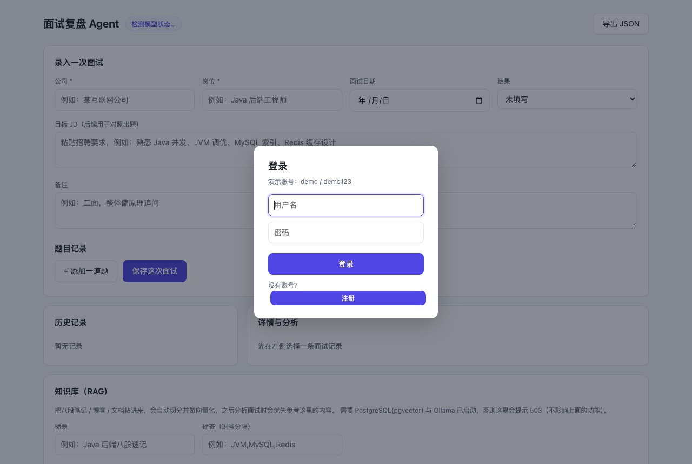
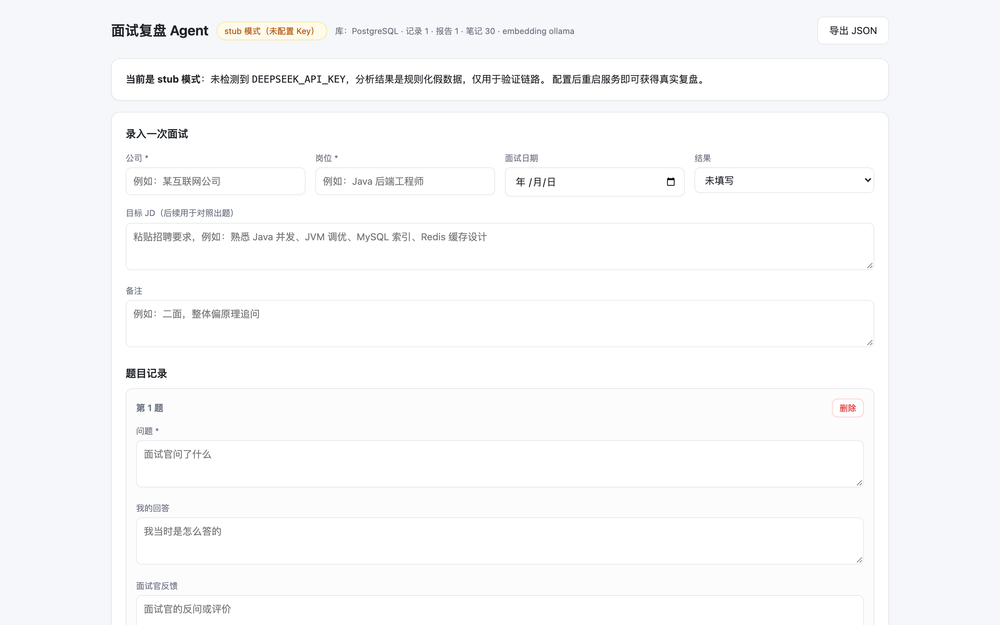
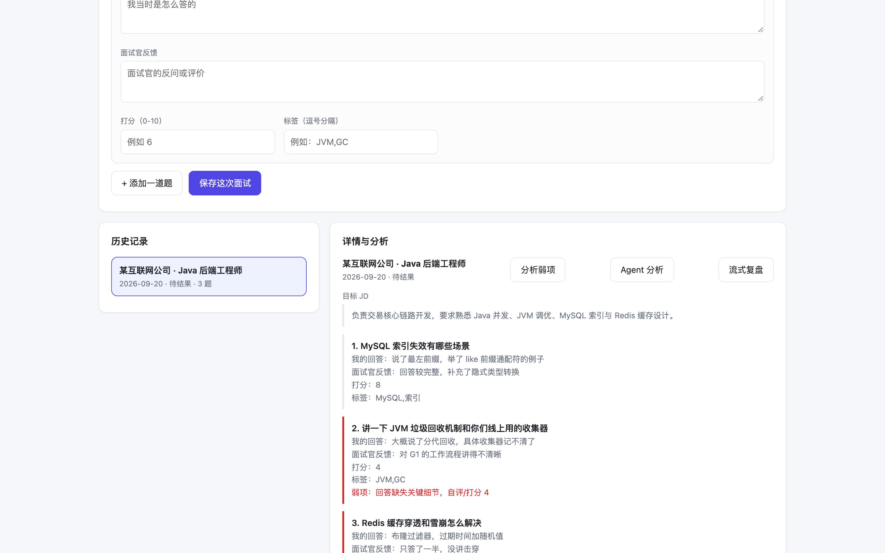
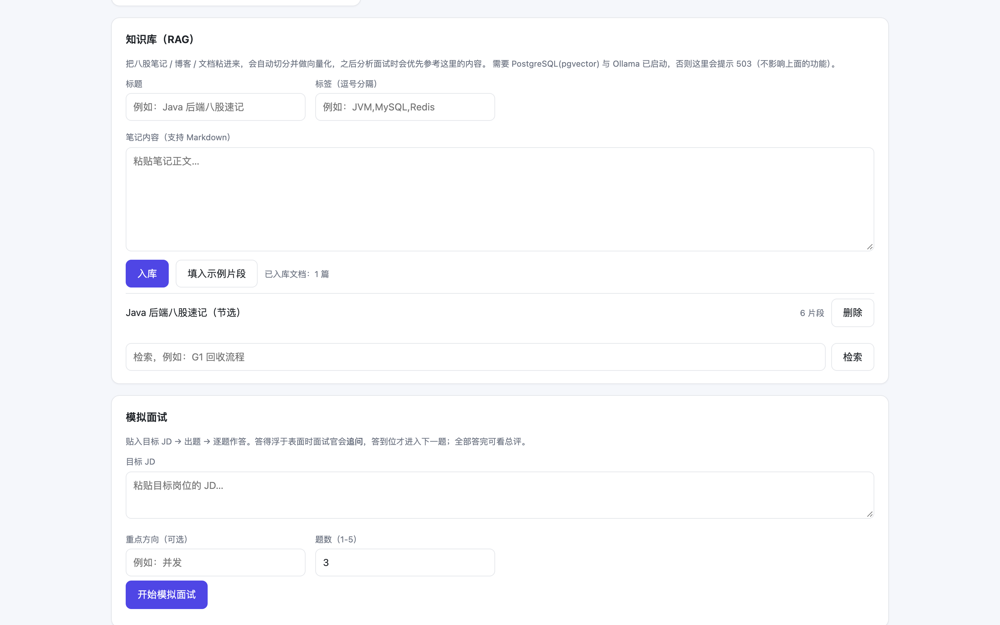
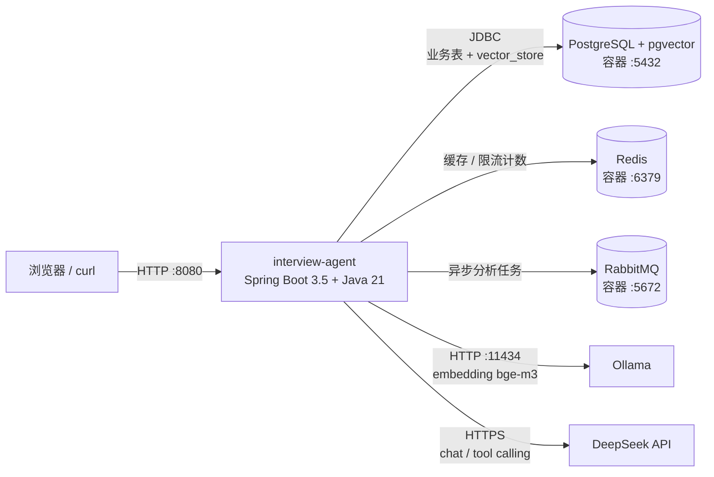

# interview-agent · AI 面试复盘 Agent

[](https://github.com/dreamback2025/interview-agent/actions/workflows/build.yml)

> 一句话：**录入一次真实面试 → LLM 分析弱项 → RAG 检索知识库增强 → 输出可执行的补强计划 → 多轮模拟面试 → SSE 流式复盘。**

技术栈：Java 21 · Spring Boot 3.5.16 · Spring AI 1.1.8（DeepSeek，OpenAI 协议）· Ollama bge-m3 + PostgreSQL/pgvector · Redis · RabbitMQ · JPA · Docker Compose · SSE · Micrometer/Prometheus

**核心能力**：面试记录结构化落库 · 弱项分析 + 补强建议 · 知识库语义检索（标题切分 + 1024 维向量 + HNSW 索引）· **混合检索（向量 + 关键词 + RRF 融合）** · **笔记覆盖度判定（区分「该复习」与「该补笔记」）** · Function Calling（`@Tool` 由模型自主调用）· 多轮模拟面试与打分 · SSE 流式复盘 · 跨记录会话记忆 · 结果缓存与幂等 · 异步分析任务 · **JWT 鉴权与多用户数据隔离** · **按用户限流（滑动窗口 + Redis Lua）** · traceId 全链路 + LLM/RAG 指标 · 34 项一键自检

**工程主线**：用后端手段解决 LLM 应用的规模化问题 —— 慢（缓存 + 异步任务）、贵（限流 + 缓存幂等去重，避免重复烧 token）、不安全（JWT 鉴权 + 多用户数据隔离）、不可靠（全链路降级）、不可观测（Micrometer 指标）。LLM 与 RAG 只是链路的两端，工程难点在中间这段。

> 每一块功能都附**可复现的实测数据**（见下文各节）。


---

## 1. 快速开始

启动后浏览器打开 **<http://localhost:8080>** 即可使用（无需任何前端构建，页面由后端 `static/index.html` 直接提供）。

页面功能：填表单录入面试（题目行可增删）→ 左侧历史记录 → 右侧查看详情 → 点「分析弱项」看复盘报告（答得好/差、知识盲区、优先补 3 点）。
分析完成后弱项会自动回写到题目卡片上，用红色左边框标出。

> 页面改动后需重启服务才能生效（`Ctrl+C` 后重新 `./run.sh`）。

### 启动后访问地址

服务默认端口 **8080**，启动成功后访问：

| 用途 | 地址 |
|---|---|
| **网页界面**（录入面试 / 查看复盘报告） | <http://localhost:8080> |
| 健康检查 | <http://localhost:8080/actuator/health> |
| 查看当前模型模式（`deepseek` / `stub`） | <http://localhost:8080/api/llm/mode> |
| 模型联通性冒烟 | <http://localhost:8080/chat?q=你好> |
| H2 数据库控制台 | <http://localhost:8080/h2-console> |
| **运行指标**（缓存命中、任务、限流） | <http://localhost:8080/actuator/prometheus> |
| RabbitMQ 管理台（仅容器编排时） | <http://localhost:15672> |

容器编排占用的端口：`8080`(app) / `5432`(postgres) / `6379`(redis) / `5672`+`15672`(rabbitmq) / `11434`(ollama)。

打开首页若返回 `500 No static resource .`，说明当前进程是页面加入之前启动的旧进程，重启即可（H2 是文件库，已录入的数据不会丢）。

端口不是 8080 时：检查是否设置了 `SERVER_PORT` / `SERVER__PORT` 环境变量（Spring Boot 宽松绑定会覆盖 `server.port`），启动时显式加 `--server.port=8080` 即可，改端口则访问对应地址。

### 1.1 启动（只需要 JDK 21）

```bash
git clone <仓库地址> && cd interview-agent
./run.sh
```

- **Maven 不用装**：仓库自带 Maven Wrapper（`./mvnw`），`run.sh` 会优先使用它
- **数据库不用装**：默认 H2 文件库（`./data/`），零依赖即可跑通全链路
- **没有 Key 也能跑**：自动进入 `stub` 模式，除 LLM 外的链路（录入、落库、Prompt 拼装、JSON 解析、弱项回写）都能真实验证

依赖下载慢的话，把 `~/.m2/settings.xml` 换成国内镜像即可。

### 1.2 接入真实 DeepSeek

> **Key 只在进程启动时读取一次**，改配置后必须重启服务才生效。
> 启动日志里会直接打出解析结果，一眼就能确认：
> ```
> INFO  ... LlmConfig : LLM 模式 = deepseek（model=deepseek-chat）
> WARN  ... LlmConfig : LLM 模式 = stub（原因：未检测到可用 Key（为空或仍是占位符））
> ```
> 注意：环境变量被设成空字符串时，Spring **不会**回退到 `application.yml` 里的默认值，同样会掉进 stub。

```bash
export DEEPSEEK_API_KEY=sk-xxxxxxxx
./run.sh
```

> **Key 的三种放法**（都不会进版本库）：
> 1. 环境变量：`DEEPSEEK_API_KEY=sk-xxx ./run.sh`
> 2. 本地 profile：新建 `src/main/resources/application-local.yml`（已在 `.gitignore` 中），写入
>    `spring.ai.openai.api-key: sk-xxx`，然后 `SPRING_PROFILES_ACTIVE=local ./run.sh`
> 3. 从模板起步：`cp .env.example .env` 填好后 `set -a && source .env && set +a && ./run.sh`
>
> `application.yml` 里只保留占位符 `${DEEPSEEK_API_KEY:sk-placeholder-not-set}`，不会包含任何真实密钥。

确认是否切换成功：

```bash
curl http://127.0.0.1:8080/api/llm/mode   # 返回 deepseek 即已接真模型
curl "http://127.0.0.1:8080/chat?q=你好"   # 冒烟：能回话就说明模型通了
```

出现 `404` 或连接类报错时，把 base-url 换成带版本号的：

```bash
DEEPSEEK_BASE_URL=https://api.deepseek.com/v1 ./run.sh
```

### 1.3 一键跑通闭环

```bash
bash scripts/smoke.sh          # 服务已启动时
bash scripts/verify-all.sh     # 全功能自检：28 项，逐项 PASS/FAIL
./mvnw test                    # 单元测试（纯离线，不需要任何外部服务）
```

`scripts/` 下的脚本：

| 脚本 | 用途 |
|---|---|
| `smoke.sh` | 快速冒烟：录入 → 列表 → 详情 → 分析 → 出题 |
| `verify-all.sh` | **全功能自检（28 项）**：服务/模型、录入分析落库导出、RAG 检索命中断言、工具调用、模拟面试、流式 + 会话记忆 |
| `ui-smoke.js` | 用 jsdom 真实执行页面 JS（`SKIP_SLOW=1` 跳过慢步骤） |
| `ui-shot.js` | 用本机 Chrome 无头截图到 `docs/screenshots/`（需 `puppeteer-core`，仅开发用） |
| `setup-rag.sh` | RAG 环境安装（PostgreSQL 17 + pgvector + Ollama + bge-m3） |
| `run-postgres-local.sh` | 用与 `docker-compose.yml` 一致的 env 契约，本地以 PostgreSQL 启动 |
| `sample-note.json` | 示例八股笔记（验证切分与检索） |
| `eval/corpus.md` | **RAG 评测语料**：30 个知识点的八股笔记（`## <tag> \| <标题>` 格式，tag 用于自动判定命中） |
| `eval/queries.json` | **RAG 评测集**：40 条自然口语提问（含期望 tag）+ 20 条负样本 |
| `eval/run-eval.py` | **RAG 检索质量评测**：Hit@K / MRR / 阈值敏感性，输出 `docs/rag-eval-report.md` |

---

## 1.4 界面预览

> 截图在**离线桩模式**（未配置 API Key）下采集 —— 零依赖即可复现：
> `./run.sh` 后访问 <http://localhost:8080>，或跑 `node scripts/ui-shot.js` 自动重截
> （用本机 Chrome + puppeteer-core，无头模式，自动完成登录后采集）。

**登录**：默认开启 JWT 鉴权，未登录时业务区被遮罩挡住；演示账号 `demo / demo123` 随启动自动创建，也可现场注册。



**录入与分析**：填表录入面试 → 左侧历史记录 → 右侧详情。分析完成后，弱项会**回写到题目卡片**上（红框标注）。顶栏显示当前用户与所属数据库。





**知识库（RAG）**：文档列表带片段数与删除按钮，删除会连带清掉该文档的全部向量片段。



---

## 2. 接口清单

> 除下表标注「免鉴权」的接口外，其余都需要请求头 `Authorization: Bearer <token>`，否则返回 401。

| 方法 | 路径 | 说明 |
|---|---|---|
| POST | `/api/auth/register` | **免鉴权** 注册，成功即返回 token |
| POST | `/api/auth/login` | **免鉴权** 登录换取 token |
| GET | `/api/auth/me` | 校验 token 是否有效 |
| GET | `/chat?q=xxx` | 模型联通性冒烟 |
| GET | `/api/llm/mode` | 当前模式：`deepseek` / `stub` |
| POST | `/api/interviews` | 录入一次面试（含若干题目） |
| GET | `/api/interviews` | 面试记录列表 |
| GET | `/api/interviews/{id}` | 面试详情（含题目） |
| POST | `/api/interviews/analyze/{recordId}` | 弱项分析 + 补强建议（**报告自动落库**） |
| GET | `/api/analyses?recordId={id}` | 某条面试的历史分析列表 |
| GET | `/api/analyses/{analysisId}` | 回看某次分析的完整报告 |
| GET | `/api/interviews/{id}/analysis-stream` | SSE 流式复盘（Markdown 直出，不落库） |
| GET | `/api/debug/memory?excludeRecordId=&limit=` | 查看注入给模型的「历史记忆」原文 |
| GET | `/api/debug/info` | 当前实例的库类型 / 连接串（脱敏）/ 各表数据量 |
| GET | `/api/export` | **全量导出**：所有面试记录 + 历史报告，一个可读 JSON（页面右上角「导出 JSON」按钮同款） |
| POST | `/api/mock/start` | 开始模拟面试（出题并建会话，返回 sessionId） |
| POST | `/api/mock/answer` | 作答 → LLM 打分 + 决定是否追问 |
| POST | `/api/mock/{sessionId}/finish` | 结束并生成总评（总分 / 优点 / 改进） |
| GET | `/api/mock/{sessionId}` | 整场回放 |
| POST | `/api/knowledge/upload` | 笔记入库（切分 → embedding → pgvector） |
| GET | `/api/knowledge/search?q=&topK=5` | 相似度检索 |
| GET | `/api/knowledge/docs` | 已导入文档目录 |
| DELETE | `/api/knowledge/docs/{docId}` | 删除文档及其全部 chunk |
| POST | `/api/interviews/agent-analyze/{recordId}` | 模型自主调用工具版分析（失败自动降级为普通分析） |
| GET | `/api/agent/tools/knowledge?q=` | 工具自检——直接检索知识库 |
| GET | `/api/agent/tools/weak-points?topic=` | 工具自检——查历史弱项 |
| GET | `/api/agent/tools/jd?jd=` | 工具自检——提炼 JD 要求 |

---

## 2.5 RAG 知识库 ✅ 已跑通

链路：**笔记 → 按标题/段落切分（一 chunk 一主题）→ bge-m3 embedding(1024 维) → pgvector → 相似度检索**。

### 启动方式

```bash
./run.sh                                  # 默认走 Ollama(bge-m3) 语义 embedding
RAG_EMBEDDING=stub ./run.sh               # 无 Ollama 时用哈希兜底 embedding，仍可跑通全链路
RAG_ENABLED=false ./run.sh                # 完全关闭 RAG（其他功能不受影响）
```

### 切分策略（踩坑后修正）

**先按 Markdown 标题切小节**，小节内再按段落合并到 600 字，超长才滑窗（重叠 100），代码块内不切。

为什么必须标题优先：最初按段落切分时，1439 字的示例笔记只切出 3 段、多个主题混在一起
—— 检索「缓存击穿」会串到 MySQL 段落。改成标题优先后切出 6 段，一 chunk 一主题。
**切分粒度对检索的影响，明显大于换 embedding 模型。**

### 检索质量评测：40 正样本 + 20 负样本

完整报告见 [`docs/rag-eval-report.md`](docs/rag-eval-report.md)，可一键复跑：
`python3 scripts/eval/run-eval.py`（报告会自动标注当前检索模式与对照基线）

| 指标 | 纯向量 | **混合检索（当前默认）** |
|---|---|---|
| Hit@1（正确答案排第一） | 28/40 = 70.0% | **33/40 = 82.5%** |
| **Hit@3** | 38/40 = 95.0% | **40/40 = 100.0%** |
| Hit@5 | 38/40 = 95.0% | **40/40 = 100.0%** |
| **MRR** | 0.827 | **0.904** |
| 未命中 Top1 | 12 条 | **7 条** |

> ⚠️ 评测集只有 40 条，**1 条 = 2.5 个百分点**。实测同一套代码在「语料重新导入」前后会有 ±1 条波动
> （HNSW 是近似索引，语料重建后近邻结果可能变化），因此 Hit@1 在 **82.5%~85%** 区间。
> 报数字时带上波动范围，被追问时站得住。

> 两列是同一套语料/查询/embedding 下，仅切换 `app.rag.hybrid.enabled` 的对照结果。
> 「混合检索」= 向量语义 + 关键词（tsvector + GIN）+ RRF 融合，机制与副作用见 [2.15](#215-混合检索向量--关键词--rrf-融合)。

评测设计（这三条决定了结果可信度）：

- 语料是 **30 个知识点**的八股笔记；提问是 **40 条自然口语提问**，刻意避开文档标题用词
  （例如问「堆开到 64G、要求停顿 10ms 以内该选哪种回收器」，而不是问「G1 收集器」）
- 另设 **20 条负样本**（语料中完全不存在的主题，如 Kafka / K8s / Elasticsearch），用于测假阳性
- 命中判定基于文档 `tags` 自动完成，无人工标注介入

**最有价值的结论来自负样本**：

| 阈值 | 正样本 Top1 通过 | 负样本误判 |
|---|---|---|
| ≥55% | 92.5% | 40.0% |
| ≥58% | 82.5% | 15.0% |
| ≥60% | 72.5% | **0%** |
| ≥65% | 22.5% | 0% |

负样本（毫不相关的主题）最高能拿到 **59.9%**，比正样本最低分（40.1%）还高 20 个百分点。
**不存在可用的阈值工作点** —— 想让误判归零就要损失四分之一的正样本。
所以这类系统的验收标准只能是排序指标（Hit@K / MRR），不能写成「相似度 > 0.7 即命中」。

> 早期版本用 6 条**与文档标题高度重合**的提问做过验证，得到「6/6 命中、相似度 61%~79%」。
> 那个测试没有负样本对照，**说明不了效果**，现已降级为回归冒烟（`scripts/verify-all.sh` 里的命中断言）。
> 检索效果以本节和 `docs/rag-eval-report.md` 为准。

> 切换 embedding 后**必须重新导入笔记**：旧 chunk 是用另一个模型编码的，
> 留在库里会和新向量不同空间，检索结果会乱。删文档用 `DELETE /api/knowledge/docs/{docId}`。

### RAG 增强分析的效果

同一条面试记录，开启知识库前后，模型给出的盲区粒度明显不同：

| | 盲区示例 |
|---|---|
| 无知识库 | 「G1 的 Region 划分、Young/Old 回收流程、Mixed GC 触发条件」 |
| **有知识库** | 「G1 关键调优参数：`-XX:MaxGCPauseMillis`（默认 200ms）、`-XX:InitiatingHeapOccupancyPercent`（默认 45%）」<br>「布隆过滤器的误判率和元素无法删除的局限性」 |

后者的细节**只存在于笔记里** —— 证明检索到的片段确实进了 Prompt。

### 环境准备（需在你自己的终端执行）

系统级安装要写 `/opt/homebrew`，受限环境装不了，请手动跑：

```bash
bash scripts/setup-rag.sh
```

等价于：

```bash
brew install postgresql@17 pgvector     # 注意是 17，不是 16（原因见下）
brew services stop postgresql@16 2>/dev/null || true
brew services start postgresql@17
createdb interview_vector
psql -d interview_vector -c "CREATE EXTENSION IF NOT EXISTS vector;"
```

> ⚠️ **必须用 postgresql@17**：brew 的 pgvector 0.8.6 只为 `postgresql@17` / `@18` 编译扩展文件，
> PG16 的 `share/postgresql@16/extension/` 里没有 `vector.control`，
> 会报 `extension "vector" is not available`。已验证扩展文件位于
> `/opt/homebrew/share/postgresql@17/extension/vector.control`。

Ollama 用官方包（brew 那版要连带拉 python@3.14 + mlx，大且容易卡）：

```bash
curl -L --progress-bar -o /tmp/Ollama-darwin.zip https://ollama.com/download/Ollama-darwin.zip
unzip -q /tmp/Ollama-darwin.zip -d /Applications
# 首次启动前先建好模型目录，否则可能报 remove ~/.ollama/models/manifests: operation not permitted
mkdir -p ~/.ollama/models/manifests ~/.ollama/models/blobs
/Applications/Ollama.app/Contents/Resources/ollama serve &
/Applications/Ollama.app/Contents/Resources/ollama pull bge-m3    # 1.2GB
```

> ⚠️ **YAML 缩进坑（踩过）**：`ollama:` 必须是 `spring.ai` 的子节点。
> 一旦缩进成 `spring.ai.openai` 的子节点，`spring.ai.ollama.*` 全部失效，
> embedding 会静默退回 Ollama 默认模型 `mxbai-embed-large`，报
> `model "mxbai-embed-large" not found`。改完 yml 记得 `mvn package` 重启。

若 Postgres 用户不是当前 macOS 用户，启动时覆盖：`VECTOR_DB_USER=xxx VECTOR_DB_PASSWORD=yyy ./run.sh`

> ⚠️ **镜像坑**：国内 brew 镜像（阿里/清华）bottle 不全，会出现
> `404 ... gettext-1.0.arm64_tahoe.bottle.2.tar.gz` / `python@3.14` 这类报错，
> 导致 postgresql / ollama 装到一半失败。有梯子时**不要用镜像**：
> `unset HOMEBREW_BOTTLE_DOMAIN` 并删掉 `~/.zshrc` 里那行 export，再重跑脚本即可（脚本是幂等的，已装的会跳过）。
> `ollama` 的 brew 配方要拉 `python@3.14 + mlx`（体积大），脚本在 brew 失败时会自动改用官方 zip。

### 验证

```bash
curl -X POST http://localhost:8080/api/knowledge/upload \
  -H "Content-Type: application/json" \
  -d @scripts/sample-note.json
curl "http://localhost:8080/api/knowledge/search?q=G1%20回收流程&topK=3"
```

### 页面入口

首页底部「**知识库（RAG）**」区块：粘贴笔记（或点「填入示例片段」）→ 入库 → 用检索框验证召回，
结果按相似度排序展示。环境没就绪时该区块会显示 503 提示，**不影响上面录入/分析功能**。

### RAG 增强分析

`AnalysisService` 在生成复盘报告前，会先用「岗位 + 题目标签」检索知识库，把命中的 3 个片段塞进 Prompt，
让模型判断回答是否覆盖了笔记里的要点。**知识库不可用时静默降级为空**，分析照常完成（日志打一条 warn）。

---

## 2.6 Function Calling（模型自主调用工具）

三个工具，由模型自己决定调不调、调几次（不是我们在代码里写死流程）：

| 工具 | 作用 |
|---|---|
| `searchKnowledgeBase(query)` | 查候选人笔记里有没有覆盖某个知识点 |
| `searchWeakPoints(topic)` | 查历史上这个方向是否**已经暴露过弱项**（判断是否老问题重犯） |
| `getJdRequirements(jd)` | 从 JD 提炼关键技术要求 |

- 代码：`agent/InterviewTools`（`@Tool` 注解）、`agent/AgentAnalysisService`
- 入口：`POST /api/interviews/agent-analyze/{recordId}`，页面「**Agent 分析**」按钮
- **失败自动降级**为不带工具的普通分析，不会出现"点了没反应"
- 自检端点：`/api/agent/tools/*` 可绕过模型单独验证每个工具

已用 `--logging.level.org.springframework.ai=DEBUG` 确认模型真的发起了调用：

```
DefaultToolCallingManager : Executing tool call: getJdRequirements
MethodToolCallback        : Successful execution of tool: getJdRequirements
DefaultToolCallingManager : Executing tool call: searchWeakPoints   ×2
```

### 设计要点

- 业务数据仍在 H2，向量数据走独立 Postgres 数据源；**该数据源刻意不注册为 Spring bean**，
  否则会被 JPA 当成主数据源（曾导致 Postgres 没起时整个应用起不来）。
- `VectorStore` 用 `@Lazy`：Ollama / Postgres 没启动时，其他功能照常可用，
  只有调用 RAG 接口才报 **503** 并提示怎么修。
- 多个模型提供方并存，必须用 `spring.ai.model.chat=openai` / `spring.ai.model.embedding=ollama` 指定，
  否则 `ChatClient.Builder` 会因多个候选而失败。
- 不想要 RAG 时：`RAG_ENABLED=false ./run.sh`。

### 录入示例

```bash
curl -X POST http://127.0.0.1:8080/api/interviews \
  -H "Content-Type: application/json" \
  -d '{
    "company": "某互联网公司",
    "position": "Java 后端工程师",
    "interviewDate": "2026-09-20",
    "result": "挂了",
    "jd": "负责交易核心链路，要求 Java 并发、JVM 调优、MySQL 索引、Redis 缓存",
    "questions": [
      {
        "question": "讲一下 JVM 垃圾回收机制和线上用的收集器",
        "myAnswer": "大概说了分代回收，具体收集器记不清了",
        "feedback": "对 G1 的工作流程讲得不清晰",
        "score": 4,
        "tags": "JVM,GC"
      }
    ]
  }'
```

### 弱项分析返回示例（真实模型）

```json
{
  "summary": "原理题普遍答得浅，工程题有细节。",
  "goodQuestions": [{ "question": "…", "reason": "…" }],
  "weakQuestions": [{ "question": "…", "reason": "…" }],
  "knowledgeGaps": ["G1 回收流程", "缓存击穿"],
  "topPriorities": [
    { "point": "G1 回收流程", "practiceAdvice": "画一遍 G1 的 Young GC / Mixed GC 时序图，讲给同事听 10 分钟" }
  ]
}
```

分析完成后，弱项会**自动回写到 `interview_question.weak_points`**，为后续检索/统计做准备。

---

---

## 2.7 模拟面试（多轮追问 + 打分）

流程：**贴 JD → 出题 → 逐题作答 → 答得浅就被追问 → 答到位才进下一题 → 结束生成总评**。全程落库。

| 接口 | 说明 |
|---|---|
| `POST /api/mock/start` | 按 JD 出题并建会话，返回 `sessionId` + 题目列表 |
| `POST /api/mock/answer` | `{sessionId, questionIndex, answer}` → `score`(0-100) + `feedback` + `followUp` |
| `POST /api/mock/{id}/finish` | 汇总：`totalScore` + `comment` + `strengths` + `improvements` |
| `GET /api/mock/{id}` | 整场回放（面试官/候选人每轮发言 + 得分） |

规则约束（写在 Prompt 里，模型遵守）：
- 回答浮于表面 → 给一道追问，顺着没讲清的点继续问
- 回答到位 → `followUp` 返回空字符串，前端据此出现「下一题」
- **同一题最多追问两次**，第三次回答必须以结束本题收尾（避免无限追问）

页面「**模拟面试**」区块：填 JD / 重点方向 / 题数 → 开始 → 逐题作答，实时看到得分与追问。

真实模型实测（3 题会话）：

```
第 1 题 答「大概就是用 synchronized 保证线程安全吧」→ 得分 20 → 追问 ReentrantLock 多了哪些能力
追问轮 答出可中断/超时/公平锁/Condition      → 得分 85 → 本题结束
第 2、3 题                                    → 各 55 分
结束汇总 → 总分 55，给出 3 条优点 + 3 条具体改进建议
回放   → 10 轮对话完整保留（含追问）
```

---

## 2.8 SSE 流式输出 + 会话记忆

### SSE 流式复盘

```bash
curl -N http://localhost:8080/api/interviews/1/analysis-stream
```

- 返回 `text/event-stream`，`Transfer-Encoding: chunked`，按 token 逐段推送
- 为什么用 **Markdown 而不是 JSON**：流式下没法做结构化校验（JSON 中途是残缺的），
  所以流式走 Markdown 直出，结构化报告仍由 `/api/interviews/analyze/{id}` 提供
- 流式结果**不落库**（页面有提示）；要存档用「分析弱项」
- 页面「**流式复盘**」按钮：`fetch` + `ReadableStream` 逐字渲染（`EventSource` 只支持 GET，
  也能用，但用 fetch 更方便控制中断与错误处理）

### 会话记忆

分析时自动带上「**其他历次面试的复盘结论 + 当时盲区**」（最多 3 条），让模型识别老问题。
实测效果 —— 同一场面试，开记忆后模型会主动点名：

> 「Mixed GC 等核心机制完全未答出，**与历史复盘中的盲区完全重合，属于同一问题反复出现且未补强**」

自检端点（直接看注入给模型的原文）：

```bash
curl "http://localhost:8080/api/debug/memory?excludeRecordId=1&limit=3"
```

**为什么没用 Redis**：记忆内容本来就以报告形式存在 `interview_analysis` 表里，直接查即可；
Redis 的价值在多实例共享缓存、高频读写场景，这个单机 MVP 用不上。
想换只需替换 `MemoryService`（对外只暴露 `recentInsights`），业务代码不用动。
开关：`MEMORY_ENABLED=false ./run.sh`。

---

## 2.9 Docker Compose 全量编排

### 一键起全栈

```bash
export DEEPSEEK_API_KEY=sk-xxx
docker compose up -d --build
docker compose exec ollama ollama pull bge-m3      # 首次要拉模型（1.2GB）
# 浏览器打开 http://localhost:8080
```

五个服务：

| 服务 | 作用 | 挂掉会怎样 |
|---|---|---|
| `postgres` | 业务表 + 向量表（同库），pgvector 已内置 | 应用起不来 —— 唯一强依赖 |
| `ollama` | 本地 embedding（bge-m3） | RAG 检索 503，其余功能正常 |
| `redis` | 结果缓存 / 限流计数 | 自动跳过缓存、限流放行 |
| `rabbitmq` | 异步分析任务队列 | 自动降级为本地线程池 |
| `app` | 应用本身 | — |

早先的 `mysql` 收进 `legacy` profile，默认不启动（`docker compose --profile legacy up -d` 才起）。

### 数据库完全容器化（不需要本机装 PostgreSQL）

| 项 | 做法 |
|---|---|
| 镜像 | `pgvector/pgvector:pg16` —— pgvector 扩展已内置，不用手动编译 |
| 初始化 | `db/init-vector.sql` 挂到 `/docker-entrypoint-initdb.d/`，首启自动 `CREATE EXTENSION vector` |
| 持久化 | 命名卷 `pg-data`，容器删掉数据还在 |
| 端口 | 宿主机端口 `${POSTGRES_HOST_PORT:-5432}`；**本机已装 PostgreSQL（brew 默认占 5432）时用 `POSTGRES_HOST_PORT=5433` 覆盖**，否则端口冲突起不来 |

```bash
# 本机已装 PostgreSQL 时这样起
POSTGRES_HOST_PORT=5433 docker compose up -d postgres

# 验证
docker exec interview-postgres psql -U interview -d interview_vector \
  -c "SELECT extversion FROM pg_extension WHERE extname='vector';"
```

**实测记录**（容器数据库 + 容器 Redis/RabbitMQ + 本机 Ollama）：

```text
容器状态     healthy（PostgreSQL 16.15，pgvector 0.8.6）
中文分词     to_tsvector('simple','mysql 索引 引失 失效') 正常 → 混合检索的关键词通道可用
应用自检     34/34 通过、0 失败
数据落库     9 张业务表、6 个 chunk 全部回填了 content_tokens
```

> 踩过的坑：初始化脚本曾用 `#` 写注释 —— **PostgreSQL 不认 `#`（那是 MySQL 语法）**，
> 导致 `syntax error at or near "#"`、容器启动即退出。而且首次初始化失败后
> **必须连数据卷一起删**（`docker compose down postgres -v`）才能重来，否则会跳过 initdb.d。

### 架构



数据流：**面试记录/报告/模拟面试 → PostgreSQL**；**笔记切分后的 chunk + 1024 维向量 → 同一个 PostgreSQL 的 `vector_store` 表**（HNSW cosine 索引）；**embedding 由本地 Ollama 算**，只有对话/工具调用出网到 DeepSeek。

### Dockerfile 要点

- **多阶段构建**：构建镜像用 `maven:3.9-eclipse-temurin-21`，运行镜像只留 `eclipse-temurin:21-jre`
- 先 `COPY pom.xml` + `dependency:go-offline` 再拷源码 → 改代码不会重下依赖
- 构建阶段写了阿里云 Maven 镜像的 `settings.xml`，国内构建快很多
- **非 root 运行**（uid 1001）、`MaxRAMPercentage=75`、时区 `Asia/Shanghai`
- 健康检查用 bash 的 `/dev/tcp` 探测（temurin 镜像里没有 curl）

### 容器里为什么用单库

业务表和向量表都放在同一个 PostgreSQL 里 —— 少一个组件、少一份备份、事务边界更清晰。
本地开发的「H2 存业务 + PG 存向量」是双数据源设计（见 `VectorStoreConfig`），
容器里把两者指向同一个 URL 即可，**代码零改动**：

```
BIZ_DB_URL    = jdbc:postgresql://postgres:5432/interview_vector    # 业务表
VECTOR_DB_URL = jdbc:postgresql://postgres:5432/interview_vector    # 向量表（同一个库）
```

### 本地模拟容器（不用 Docker）

```bash
bash scripts/run-postgres-local.sh      # 与 compose 里 app 服务完全相同的环境变量
```

### 应用镜像构建（多阶段）实测

```bash
docker compose build app
# 或本机 Ollama 已跑时，跳过 ollama 服务：
OLLAMA_BASE_URL=http://host.docker.internal:11434 docker compose up -d --no-deps --build app
```

**实测记录**：

| 项 | 结果 |
|---|---|
| 构建耗时 | 约 4 分钟（首次，含拉基础镜像 + Maven 依赖） |
| 运行镜像大小 | 810 MB（`eclipse-temurin:21-jre`，多阶段后不含 Maven 与源码） |
| 容器内运行用户 | **uid 1001（非 root）** ✅ |
| 健康检查 | `healthy`（`/dev/tcp` 探测 8080，容器内无 curl） |
| 端到端自检 | **34/34 通过、0 失败**（连容器 DB + 容器 Redis/RabbitMQ） |

> 沙箱环境提示：本机 `docker build` 用 buildx 时可能报 `operation not permitted`（写
> `~/.docker/buildx/` 被拒）。这时用 `DOCKER_BUILDKIT=0 docker compose build app`
> 走传统 builder 即可。

### 已验证 / 未验证

| 项 | 状态 |
|---|---|
| `application-postgres.yml`：PG 上自动建 6 张业务表（含 `position` 关键字转义） | ✅ 实测 |
| PG 上跑通录入 / 分析 / RAG 检索 / 会话记忆 | ✅ 实测 |
| **容器数据库**（`pgvector/pgvector:pg16` + 初始化脚本 + 持久化卷） | ✅ 实测（PG 16.15 / pgvector 0.8.6 / 自检 34/34） |
| 容器 Redis / RabbitMQ 与应用的联动（缓存命中 / MQ 投递） | ✅ 实测 |
| **应用镜像构建 `docker build`（多阶段，非 root）** | ✅ 实测（810MB 镜像、uid 1001） |
| **容器化应用端到端自检** | ✅ 实测（34/34 通过） |
| `docker-compose.yml` YAML 语法与 env 契约 | ✅ 校验通过 |
| `docker compose up -d --build` 含 **ollama 服务** 的全量一键起 | ⚠️ 未实测（本机 11434 已被 Ollama 占用，会端口冲突；用 `OLLAMA_BASE_URL=http://host.docker.internal:11434` 可绕开） |

---

## 2.10 缓存与降级设计

**缓存解决什么问题**：LLM 调用按 token 收费且单次耗时 3~10 秒，同一份内容重复分析既慢又烧钱。

| 机制 | 说明 |
|---|---|
| 分析结果缓存 | key = `prompt版本` + `记录id` + `内容指纹`，内容相同**不重复调用模型** |
| 自动失效 | 指纹覆盖题目 / 回答 / 反馈 / 打分，任一变化 key 自动变，无需手工清理 |
| Prompt 版本 | 改 System Prompt 时递增 `PROMPT_VERSION`，旧缓存自然失效 |
| 检索缓存 | 检索结果缓存 `kbsearch:*`，入库 / 删文档后按前缀批量失效 |
| 防穿透 | 空结果也写入短 TTL 缓存，避免同一无效请求反复打到模型 |

**降级原则**：Redis、向量库、Ollama、模型 API 都是**可降级组件**：

| 组件不可用 | 表现 |
|---|---|
| Redis | 缓存读写静默失败，主流程照常执行（指标 `result="error"` 上升；连续失败只告警一次，避免日志风暴） |
| 向量库 / Ollama | 检索 503，分析退化为不带知识上下文；录入与报告回看不受影响 |
| 模型 API（无 Key） | 自动切离线桩模式，除 LLM 外的链路全部可跑 |

**为什么它们不参与存活判定**：Redis / MQ 挂掉时应用仍然可用，
所以 `/actuator/health` 不会因这两个组件变成 DOWN —— 否则会触发误告警和不必要的重启。

已验证的两条路径：

```text
无 Redis：接口全部 200，app_cache_requests{result="error"} 上升，主流程不受影响
有 Redis：第 1 次分析 miss → 写入；第 2 次相同请求 hit = 1，不再调用模型
```

---

## 2.11 异步分析任务

**解决什么问题**：首次分析要调模型，单次 3~10 秒；同步接口会让 HTTP 请求一直挂着 —— 占用连接、前端转圈、还有超时风险。

| 接口 | 说明 |
|---|---|
| `POST /api/analysis/tasks` | 提交任务，**立即返回 202** 与 `taskId`，不等模型 |
| `GET /api/analysis/tasks/{taskId}` | 查状态；`SUCCESS` 时直接把报告带回来 |
| `GET /api/analysis/tasks?recordId=` | 最近 20 条任务 |
| `POST /api/analysis/tasks/{taskId}/retry` | 失败任务重试（taskId 不变，便于追踪） |

状态机：`PENDING → RUNNING → SUCCESS / FAILED`

同步接口 `POST /api/interviews/analyze/{id}` **仍然保留**：演示、自检，以及**命中缓存时**
（本来就毫秒级）走同步更直接。

**三个关键设计**：

1. **先落库，再投递** —— 反过来做的话，消息发出去了但写库失败，消费者查不到任务，
   消息等于丢失且无从追踪。先落库的最坏情况是任务卡在 `PENDING`，可以扫描出来补偿。

2. **幂等在数据库层**：
   ```sql
   UPDATE analysis_task SET status='RUNNING' WHERE task_id = ? AND status = 'PENDING'
   ```
   消息重放或消费端重连时，第二条抢不到 `PENDING` 状态（影响 0 行）就直接跳过 ——
   不会把同一份内容分析两次，也就不会重复消耗 token。

3. **状态变更独立于业务事务**（`REQUIRES_NEW`）—— 分析失败时业务数据该回滚就回滚，
   但"这次失败了"这件事必须记下来，否则任务会永远停在 RUNNING。

**降级**：`app.async.mode=mq` 时投递 RabbitMQ，发送失败自动转本地线程池；
线程池队列满时用 `CallerRunsPolicy` 把压力还给调用方（HTTP 变慢），形成背压而不是静默丢任务。

实测（真实 RabbitMQ 容器）：

```text
MQ 正常：提交 202（0.09s）  → 通道 mq   → SUCCESS
停掉 MQ：提交 202（0.014s）→ 通道 pool → 仍然 SUCCESS（自动降级）
重复投递同一条消息：skipped +1，且报告没有重复生成
```

---

## 2.12 鉴权与数据隔离

JWT 无状态鉴权 + 全链路数据隔离。**默认开启**，可通过 `SECURITY_ENABLED=false` 关闭（单用户自用/本地调试）。

### 登录与鉴权

```bash
# 登录（演示账号随启动自动创建）
curl -X POST localhost:8080/api/auth/login -H 'Content-Type: application/json' \
  -d '{"username":"demo","password":"demo123"}'
# → {"token":"eyJ...","expiresIn":86400,"userId":1,"username":"demo","role":"USER"}

# 之后所有业务请求带上 token
curl -H "Authorization: Bearer <token>" localhost:8080/api/interviews
```

| 接口 | 说明 |
|---|---|
| `POST /api/auth/register` | 注册（用户名 3~64、密码 ≥6 位），成功即返回 token |
| `POST /api/auth/login` | 登录换取 token |
| `GET /api/auth/me` | 校验 token 是否有效 |

免鉴权路径只有三类：登录注册、`/actuator/**` 健康检查、静态页面。**其余一律要求有效 token**——包括知识库、模拟面试、分析、导出。

### 数据隔离怎么做的

| 层 | 做法 |
|---|---|
| 实体 | `interview_record` / `knowledge_doc` / `mock_session` / `analysis_task` / `interview_analysis` 各带 `user_id` |
| 关联表 | `interview_question` / `mock_turn` 不单独存，通过父实体关联 + 归属校验隔离 |
| 查询 | 所有列表/详情都走 `...AndUserId(...)`；下游子实体一律先校验父实体归属 |
| 向量检索 | embedding 的 metadata 写入 `userId`，检索时用 `filterExpression(eq("userId", uid))` **在向量库层就过滤掉别人的笔记** |
| 越权响应 | 统一返回 **404**（而不是 403）——不泄露"这条数据存在但你没权限" |
| 缓存 key | 检索缓存 key 带 `userId`。**这是最容易漏的一处**：只按 query 做 key 的话，A 的检索结果会被缓存后命中返回给 B |
| 工具调用 | `searchWeakPoints` 限定当前用户的记录范围；`searchKnowledgeBase` 走已隔离的检索服务 |

### 存量数据迁移（一个容易被忽略的坑）

项目原本是单用户无鉴权的，表里已有数据的 `user_id` 全是 `NULL`。直接开启鉴权会造成**很隐蔽的事故：老数据谁都查不到**，表现为「升级后历史记录全没了」。

`DataInitializer` 在启动时处理：

1. 确保演示账号存在（`demo` / `demo123`，可用 `DEMO_USER_ENABLED=false` 关闭）
2. 把 `user_id IS NULL` 的历史数据归给**最早创建的用户**
3. 向量库里 `metadata` 缺失 `userId` 的老 chunk 用 PostgreSQL 的 `jsonb || jsonb_build_object(...)` 补齐 —— 否则开了过滤条件后这些 chunk 永远检索不到

### 密钥与安全约定

| 项 | 做法 |
|---|---|
| 密码存储 | BCrypt 哈希，从不保存/返回明文 |
| 登录失败提示 | 用户名不存在与密码错误返回同一句提示，避免账号枚举 |
| JWT 密钥 | 环境变量 `JWT_SECRET` 注入；**长度 < 32 字节直接启动失败**（快速失败，而不是悄悄用弱密钥） |
| Token 有效期 | `JWT_TTL`，默认 86400 秒 |

```bash
# 生成一个足够强的密钥
export JWT_SECRET="$(openssl rand -base64 48)"
```

---

## 2.13 限流（按用户维度，保护模型配额与成本）

LLM 调用按 token 收费且有速率限制，**限流是成本控制的最后一道闸**。本项目的限流基于 Redis ZSET 滑动窗口 + Lua 原子脚本。

### 设计要点

| 选型 | 选择 | 理由 |
|---|---|---|
| 算法 | **滑动窗口**（ZSET + 时间戳） | 固定窗口在边界会突发（59s 内 N 次 + 第 1s N 次 = 2N 次/s），滑动窗口以「当前时刻往前推 60s」为窗口，更精确 |
| 原子性 | **Lua 脚本** | `ZREMRANGEBYSCORE → ZCARD → ZADD → PEXPIRE` 四步必须原子，否则并发下多个请求会同时通过判断再各自 ZADD，限流失效 |
| 维度 | `userId + 类.方法` | 同用户调 analyze 和调 mock/start 各算各的；免鉴权模式按 `anonymous` 统一计数 |
| 降级 | **Redis 不可用时放行** | 与项目「可降级组件不阻断主流程」哲学一致 —— 限流挂了最多多烧几个 token，不能让用户连分析都用不了 |

### 标注的接口与配额

| 接口 | qpm | 理由 |
|---|---|---|
| `POST /api/interviews/analyze/{id}` | 10 | 烧 token 的重接口 |
| `POST /api/interviews/agent-analyze/{id}` | 10 | 工具调用 + 分析，更重 |
| `GET /api/interviews/{id}/analysis-stream` | 10 | SSE 流式烧 token |
| `POST /api/mock/start` | 5 | 出题 + 单场耗时长，限最严 |
| `POST /api/mock/answer` | 20 | 每题都调，频率高，限放宽 |
| `POST /api/mock/{id}/finish` | 10 | 汇总烧 token |

未标注的接口（录入 / 列表 / 详情 / 知识库 CRUD）不限流 —— 它们不调模型。

### 实测（真实 Redis 容器）

连发 12 次 `analyze`（qpm=10，窗口内已有自检留下的 1 次）：

```
第 1-9 次:  HTTP 200（通过）
第 10-12 次: HTTP 429（拒绝，提示「请求过于频繁，每分钟限 10 次」）

指标:
  app_ratelimit_total{result="allowed"} 17
  app_ratelimit_total{result="denied"}  3
  app_ratelimit_total{result="error"}   0
```

同时验证维度隔离：连发 3 次 `GET /api/interviews`（未标注 @RateLimit）全部 200，不受 analyze 限流影响。

### 关闭与配置

```bash
# 关闭限流（单机调试）
RATELIMIT_ENABLED=false ./run.sh

# 调整全局默认 qpm（@RateLimit 注解可按方法覆盖）
RATELIMIT_QPM=60 ./run.sh
```

---

## 2.14 可观测性（traceId 全链路 + LLM/RAG 指标）

排查 LLM 应用问题最大的痛点：一次分析涉及「HTTP 请求 → RAG 检索 → LLM 调用 → 落库 → 异步任务」，没有 traceId 时日志无法串联。本项目做了三件事。

### traceId 全链路

| 环节 | 做法 |
|---|---|
| HTTP 请求 | `TraceIdFilter`（`@Order(HIGHEST_PRECEDENCE)`，SecurityFilter 之前）生成 UUID 短码，入 MDC + 响应头 `X-Trace-Id` |
| 客户端透传 | 请求头带 `X-Trace-Id` 则沿用（跨服务调用链场景） |
| 异步线程池 | `MdcTaskDecorator` 装饰 ThreadPoolTaskExecutor，提交线程的 MDC 复制到执行线程 |
| MQ 消费者 | 不在 HTTP 线程，`AnalysisTaskConsumer` 自己生成 traceId |
| 日志格式 | `logging.pattern.level: '%-5level [%X{traceId:-}]'`，每条日志带 traceId |

实测：连发两次健康检查，响应头 `X-Trace-Id` 分别为 `d1f5ed395f584d90` / `b4d4d81459ae490c`（唯一）；传 `X-Trace-Id: my-trace-123` 则响应头沿用 `my-trace-123`；日志里出现 `[e83ebd63d44b4359]`。

### LLM 与 RAG 调用指标（Micrometer → Prometheus）

用 AOP 切面切接口方法，impl 无感知（未来加新实现自动被监控）：

| 指标 | 切点 | 含义 |
|---|---|---|
| `llm_call_duration_seconds{method,result}` | `LlmService.chat/structured` | LLM 调用耗时分布（直方图，P50/P95 可查）|
| `rag_search_duration_seconds{result}` | `KnowledgeService.search` | 检索耗时（含 embedding + 向量库 + 缓存命中/未命中）|
| `app_ratelimit_total{result}` | `@RateLimit` 切面 | 限流 allowed/denied/error |
| `app_cache_requests_total{result}` | `CacheService` | 缓存 hit/miss/error |
| `app_task_dispatched_total{channel}` | `TaskDispatcher` | 异步任务投递 mq/pool/mq_fallback |
| `app_task_finished_total{result}` | `TaskExecutor` | 异步任务 success/failure/skipped |

实测（stub 模式 + 真实 Redis/PG/Ollama）：

```
llm_call_duration_seconds{method=structured,result=success}  count=1  sum=0.036s
rag_search_duration_seconds{result=success}                   count=2  sum=1.949s  max=1.916s
app_ratelimit_total{result=allowed} 1.0
```

> stub 模式下 LLM 调用是本地规则（36ms）；换真实 DeepSeek 后这个指标会到 3~10s，是成本与延迟监控的核心。

### 为什么用 AOP 切面而不是改 impl

`DeepSeekLlmService` 是 `@Bean new` 出来的，注入 MeterRegistry 要改构造；用 AOP 切 `LlmService` 接口，impl 零改动，未来加新实现（如换 Qwen）也自动被监控。

---

## 2.15 混合检索（向量 + 关键词 + RRF 融合）

纯向量检索对「语义相近但答案不同」的同域主题区分度不足 —— 评测集里的 bad case 集中在这一类：
「索引失效」被「索引结构」挤掉、「事务失效」被「AOP」挤掉。混合检索用关键词通道补上这个短板。

### 两路召回 + RRF 融合

| 通道 | 实现 | 作用 |
|---|---|---|
| 语义 | pgvector HNSW + cosine（已有） | 召回语义相近的段落 |
| 关键词 | PostgreSQL `tsvector` + GIN 索引 | 用 token 精确匹配拉开同域主题的区分度 |
| 融合 | **RRF**（Reciprocal Rank Fusion） | `score = Σ 1/(60 + rank)`，无需把「余弦相似度」与「ts_rank」归一化到同一量纲 |

### 中文分词：为什么不用 tsvector 原生配置 / pg_trgm

PostgreSQL 内置全文检索配置（simple / english）**不切分中文** —— 整段中文会变成一个 token，检索退化成精确匹配。
实测了两种零依赖方案：

| 方案 | 正例 | 同域难负例 | 区分度 |
|---|---|---|---|
| `pg_trgm`（trigram 相似度） | 0.3448 | 0.2963 | 1.16x ❌ |
| **Java 2-gram + tsvector + ts_rank** | 0.0608 | 0.0304 | **2.0x** ✅ |

所以分词放在 Java 侧（`rag/Tokenizer`）：英文按字母数字切并小写，中文按 2-gram 切
（「索引失效」→ 索引 / 引失 / 失效），再把 token 串交给 `to_tsvector('simple', ?)` 存储、`ts_rank` 排序。
产物只含 `[a-z0-9]` 与 CJK 字符，因此可安全拼进 `to_tsquery`（`& | ! ( ) :` 等特殊字符已在分词阶段过滤）。

### 失败与降级

| 情况 | 行为 |
|---|---|
| 关键词通道不可用（业务库与向量库不同库、表/列不存在） | 返回空列表 → **自动退化为纯向量检索**，检索不会整体失败 |
| 入库后回填索引 | `ingest` 完成后异步回填该文档全部 chunk 的 `content_tokens`（幂等 DDL 懒建列 + GIN 索引） |
| Redis 缓存 | key 带检索模式（`h` / `v`）—— 模式切换后不复用旧缓存 |

### 实测收益（同语料 / 同查询 / 同 embedding，仅切换开关）

| 指标 | 纯向量 | **混合** | 变化 |
|---|---|---|---|
| Hit@1 | 70.0% | **85.0%** | **+15.0pp** |
| Hit@3 | 95.0% | **100.0%** | +5.0pp |
| MRR | 0.827 | **0.917** | +0.090 |
| 未命中 Top1 | 12 条 | **6 条** | 减半 |

**改善的典型 case**（关键词通道把同域干扰项挤下去）：

| 查询 | 纯向量 Top1（错） | 混合后 |
|---|---|---|
| CMS 当年为什么被废弃 | RDB 与 AOF 持久化（正确项 rank=2） | ✅ 命中 |
| 两个线程抢同一把锁，JVM 内部怎么处理 | JVM 运行时内存区域与参数（rank=2） | ✅ 命中 |
| 偏向锁后来为什么要默认关掉 | 事务隔离级别与 MVCC（rank=2） | ✅ 命中 |
| update 语句没走索引会锁多少行 | 事务隔离级别与 MVCC（rank=2） | ✅ 命中 |

**已知副作用（如实记录）**：关键词通道会引入新噪音，实测 **1/40 出现回退**
（「缓存和数据库的一致性」Top1 变成「分布式事务」）。缓解方向：调低关键词通道权重，或引入 cross-encoder rerank 做二次精排。

**仍未解决的 6 条**：3 条正确项稳定停在 rank=2（同域细分主题仍互相干扰），1 条从 rank=11 提升到 rank=3 但未到 Top1 ——
都指向同一结论：**关键词通道只能解决一部分，剩下需要 rerank 的语义级精排**。

### 配置

```bash
# 关闭混合检索，退回纯向量
RAG_HYBRID_ENABLED=false ./run.sh
```

---

## 2.16 负样本分级与分布重叠（测试力度自检）

**问题**：最初的 20 条负样本全是「语料里完全不存在的技术栈」（Kafka、K8s、ES……）。
这类测试**太好通过** —— 检索系统发现整句都对不上就会给低分，但它测不出真正的风险：

> 用户问的不是别的技术栈，而是**同域里没讲的那个点**。

于是把负样本按「与语料的距离」分四档（见 `scripts/eval/queries.json`）：

| 档位 | 含义 | 例子 | n |
|---|---|---|---|
| **L1** | 跨域，语料无此技术栈 | Kafka 消息积压怎么处理 | 19 |
| **L2** | 同域不同主题（域在语料内，主题没讲） | MySQL 分区表 / JVM JIT / ForkJoinPool | 7 |
| **L3** | 同主题边界（讲了规则，没覆盖此例外） | 索引跳跃扫描下最左前缀还成立吗 | 5 |
| **L4** | 词法陷阱（用词与正样本重叠，语义翻转） | 「InnoDB 用 B 树就够了，没必要 B+ 树」 | 3 |

### 实测：分数随「距离」单调递增

| 档位 | Top1 相似度均值 | 最高分 |
|---|---|---|
| L1 跨域 | 52.2% | 59.9% |
| L2 同域不同主题 | 52.7% | 57.9% |
| L3 同主题边界 | 55.3% | 63.2% |
| **L4 词法陷阱** | **67.5%** | **80.1%** |
| *正样本 最低分* | *38.3%* | — |

**L4 比 L1 高 15.3 个百分点** —— 越像正样本，系统越拒绝不了。

### 重叠区：41.8 个百分点


正样本最低 **38.3%**，难负样本（L2~L4）最高 **80.1%** → **重叠 41.8 个百分点**。
重叠越大，越说明系统在「该拒绝」的时候拒绝不了。

阈值敏感性（`hybrid=true`）：

| 阈值 | 正样本 Top1 通过 | L1 误判 | **L2~L4 误判** |
|---|---|---|---|
| ≥58% | 75.0% | 15.8% | 26.7% |
| ≥60% | 60.0% | **0%** | **20.0%** |
| ≥65% | 20.0% | 0% | 6.7% |
| ≥70% | 10.0% | 0% | 6.7% |

**L1 在 60% 就能全部拒掉；难负样本到 70% 仍有残留，而此时正样本通过率只剩 10%。**
结论同 §2.5：**不存在可用的绝对阈值**，验收只能看排序指标。

### 一个反直觉的发现：L1 与 L2 分数几乎相同

预期「同域」应比「跨域」更容易被误判，实测 52.2% vs 52.7%（基本无差异）。原因：

- L1 的跨域问题也含**泛化技术词**（「缓存」「查询性能优化」），会与语料产生弱匹配
- L2 的同域问题，其**具体主题词**（分区表、JIT、工作窃取）在语料里根本不出现，token 也对不上

**真正拉开分数的是「词法重叠」（L4），而不是「是否同域」** —— 这个结论只有分档测才看得出来。

### 关键词通道有没有被词法重叠骗？—— 没有

L4 就是为验证这个疑问设计的（用词几乎照抄正样本，只翻转语义）。对照实验：

| 档位 | 纯向量 | 混合 | 变化 |
|---|---|---|---|
| L1 | 53.2% | 52.2% | -1.0 |
| L2 | 56.3% | 52.7% | -3.6 |
| L3 | 55.7% | 55.3% | -0.4 |
| **L4** | 72.3% | **67.5%** | **-4.8** |
| 正样本 Hit@1 | 70.0% | **82.5%** | **+12.5** |

**关键词通道没被骗，它反而是「抑制器」**：让四档负样本分数全部下降（L4 降最多），同时正样本 Hit@1 提升 12.5pp。
机制是 RRF 融合稀释了向量通道的「语义虚高」—— 干扰文档在关键词通道排名低（token 对不上），融合后被拉下去。

但 L4 绝对分（67.5%）仍是四档最高，**难负样本没有被解决**：混合检索改善的是排序，
不是「知道自己的边界在哪」。真正的解法是**把这个判定用到分析报告上**（区分「笔记里有、只是没答出来」
与「笔记里压根没写」），见 §2.17 —— 而不是继续调阈值。

### 复跑

```bash
# 语料已在库时只评测（不重新导入 —— 避免 HNSW 重建引入 ±1 条波动）
BASE=http://127.0.0.1:8092 SKIP_IMPORT=1 python3 scripts/eval/run-eval.py
```

报告会自动生成分级统计、分布图（`docs/rag-eval-distribution.svg`）与基线对照。

---

## 2.17 笔记覆盖度判定（把「答错了」拆成两种动作）

分析一道**答错的题**时，系统会顺带检索用户自己的笔记，判断「这个知识点你笔记里写过吗」：

| 判定 | 报告里说什么 | 用户该做什么 |
|---|---|---|
| 笔记已覆盖 | 「你的笔记里已有《X》—— 这不是知识缺口」| 重新消化自己的笔记 |
| 笔记未覆盖 | 「你的笔记里没有这块内容 —— 这是知识缺口」| 补一篇笔记 |

没有这个判定，所有错题都只能给一句笼统的「去复习一下」。

**为什么这是本项目最有价值的一处设计**：知识库是**用户自己导入的**（个人资产），
所以「笔记里没有」这句话才有意义 —— 它把模糊的「答错了」变成了明确的「你有一个知识缺口」。闭环也随之成立：

```
导入笔记 → 分析时做参照 → 分析暴露「笔记缺口」 → 用户补一篇
   ↑                                                ↓
   └────────── 下次分析更准 ←──────────────────────┘
```

### 实现：与检索共用一套信号

判定（`RagRelevanceGate`）复用检索的双信号：

| 信号 | 含义 | 「笔记里没有」时的表现 |
|---|---|---|
| `vecTop1` | 向量通道 top1 余弦相似度 | 偏高（语义确实像）|
| `kwCoverage` | 查询分词后落在 **top1 文档**里的 token 占比 | 偏低（具体词对不上）|

### 为什么不用单一相似度阈值

§2.16 实测：正样本最低分 38.3%、难负样本最高分 80.1%，**重叠 41.8 个百分点** —— 单阈值必然二选一地失败。

### ⚠️ 踩过的坑：第二个信号选错了

最初用的是「关键词通道**命中文档数**」，实测**完全无效**：

```
Kafka 消息积压该怎么处理（跨域，本该判「笔记里没有」）→ kwHits = 6
```

关键词通道是 OR 查询（`tok1 | tok2 | ...`），任意 token 命中即计数，「消息」「处理」这类通用词在笔记里到处都有
→ 正负样本命中数都是 6~15，**毫无区分度**。换成**覆盖率**（token 必须落在**同一个文档**里）才有区分力：
正样本 cov 中位 29% vs L1 跨域 12%。

### 实测（阈值由网格搜索得到）

| 指标 | 结果 |
|---|---|
| 正样本误判（笔记里有，却判成缺口）| 4/40 = 10.0% |
| 负样本正确识别（确实没有）| 24/34 = 70.6% |
| ├ L1 跨域 | 16/19 = 84.2% |
| ├ L3 同主题边界 | 4/5 = 80.0% |
| ├ L2 同域不同主题 | 4/7 = 57.1% |
| └ **L4 词法陷阱** | **0/3 = 0%** |

阈值：`vecLow=0.40 vecMid=0.58 covLow=0.15 covMid=0.35`（`run-eval.py` 用同一批信号本地模拟 500 组合后挑的最优点）。

### 未解决的 L4（必须说清楚）

L4 的 `vec` 中位 **73%**，比正样本的 62% 还高 —— 它是「**用词完全合法、只把语义翻转**」的陷阱题
（「InnoDB 用 B 树就够了」）。从检索角度看它和正样本没有任何区别，所以任何基于「像不像」的信号都判不出它。
这类只能靠 **rerank**（cross-encoder 看 query–doc 相关性，而非词形重叠）。

### 一条产品边界（早期走过弯路）

> 这套判定最早被设计成「**问答拒答**」（系统判断能不能回答用户提问），
> 但**本项目里系统从不替用户作答** —— 它只做两件事：分析、以及把匹配的笔记列给用户看。
> 所以不存在「拒答」这个场景，判定结果应当服务于**分析报告**。
>
> 同理，检索框搜不到时不该说「无法回答」，而该提示「你的笔记里可能没有 → 去补一篇」
> （前端已实现：点「去补一篇」会把检索词自动填进标题）。因为知识库的内容本来就是用户自己导入的，
> 搜不到不是错误，是一个补录入口。

### API 与配置

对外检索入口只有 `/api/knowledge/search`（查看 / 验证自己的笔记）；
判定结果**不暴露为独立端点**，只写进分析报告的 `noteSupported` / `noteHint` 字段。
内部信号通过 `/api/debug/retrieval` 取（仅供评测脚本与排查）。

```bash
RAG_GATE_ENABLED=false ./run.sh    # 关掉判定，报告里不再标注覆盖度
```

---

## 3. 数据存储

### 先搞清楚数据在哪个库（多实例容易搞混）

页面顶部会直接显示当前实例用的库和数据量，例如：

```
库：PostgreSQL · 记录 1 · 报告 2 · 笔记 1 · embedding ollama
```

对应接口 `GET /api/debug/info`（连接串已脱敏）。**不同启动方式用不同的库**：

| 启动方式 | 数据库 | 备注 |
|---|---|---|
| `./run.sh`（默认，H2 模式） | `data/interviewdb.mv.db` | 零依赖，适合快速试用 |
| `bash scripts/run-postgres-local.sh` | PostgreSQL `interview_vector` | **真实数据在这里** |
| `SPRING_PROFILES_ACTIVE=mysql ./run.sh` | MySQL `interview_agent` | 需自备 MySQL |
| `docker compose up -d` | 容器内 PostgreSQL | 见 2.9 节 |

> ⚠️ H2 是**单进程独占**的文件库：同一个库不能同时被两个实例打开。
> 起新实例请换端口或换库，否则会报 `Database may be already in use`。

- **默认 H2**（MySQL 兼容模式，文件落盘 `./data/`），零依赖。`spring.jpa.ddl-auto=update` 自动建表。
  - H2 控制台：<http://127.0.0.1:8080/h2-console>，JDBC URL 填 `jdbc:h2:file:./data/interviewdb`，账号 `sa`，密码空。
- **切真 MySQL**：先 `docker compose up -d mysql`，再

```bash
SPRING_PROFILES_ACTIVE=mysql MYSQL_PASSWORD=root ./run.sh
```

  表结构见 `db/schema-mysql.sql`（也可依赖 `ddl-auto` 自动生成）。

### 表结构

```
interview_record   (id, company, position, interview_date, jd, result, notes, created_at)
interview_question (id, record_id, question, my_answer, feedback, score, tags, weak_points, created_at)
interview_analysis (id, record_id, model, summary, report_json, created_at)   # 分析报告快照，每次分析一条
mock_session      (id, target_jd, focus, status, total_score, summary, created_at)
mock_turn         (id, mock_session_id, turn_index, role, content, score, feedback, created_at)
```

**生成内容的保存情况**：面试记录与题目 ✅ 全部落库；弱项原因 ✅ 回写到 `interview_question.weak_points`；
分析报告全文 ✅ 以 JSON 存进 `interview_analysis.report_json`，页面「历史分析」可随时回看；
按 JD 生成的模拟题 ✅ 已落库（`mock_session` / `mock_turn`）。

### 关于「本机没装数据库」

H2 是**嵌入式数据库**，以 jar 依赖形式跑在应用进程里，**不需要安装任何数据库软件**；数据落在 `data/interviewdb.mv.db`
（二进制块格式，不是明文）。想直接看/备份/迁移数据，用页面右上角「导出 JSON」或：

```bash
curl http://localhost:8080/api/export -o interview-export.json
```

导出的 JSON 含 `interviews`（公司/岗位/JD/题目/回答/反馈/打分/标签/弱项）与 `analyses`（每份完整报告）。

> 隐私提醒：面试记录含公司、JD 和你的真实回答，属于敏感内容。**默认开启 JWT 鉴权**（演示账号 `demo/demo123`），
> `data/` 已在 `.gitignore` 中（不会进 git）。对外部署请改 `JWT_SECRET`、关 `DEMO_USER_ENABLED`、设 `DEBUG_ENDPOINTS=false`。

---

## 4. 目录结构

```
interview-agent/
├── pom.xml
├── docker-compose.yml          # 全栈编排：postgres(pgvector) + ollama + app
├── Dockerfile                  # 多阶段构建，非 root 运行
├── .dockerignore
├── run.sh                      # 本地启动（自动用工作区内的隔离版 Maven）
├── db/init-vector.sql          # 容器首启启用 vector 扩展
├── db/schema-mysql.sql         # 真 MySQL 建表语句
├── scripts/
│   ├── smoke.sh / verify-all.sh / ui-smoke.js / setup-rag.sh / run-postgres-local.sh
│   └── eval/                   # RAG 检索质量评测：corpus.md / queries.json / run-eval.py
├── docs/rag-eval-report.md     # 评测报告（由 run-eval.py 自动生成）
└── src/main/java/com/dreamback/interviewagent/
    ├── controller/             # ChatController / InterviewController / MockController / AuthController ...
    ├── service/                # 业务接口：InterviewService / AnalysisService / KnowledgeService /
    │   │                       #           MockInterviewService / AuthService
    │   └── impl/               # 对应实现（@Service 与 @Transactional 放这里，不放接口上）
    ├── llm/                    # LlmService 接口 + DeepSeek 实现 + Stub 兜底
    ├── security/               # JwtService / JwtAuthFilter / UserContext
    ├── cache|async|agent|rag   # 缓存 / 异步任务 / 工具 / 切分
    ├── entity|repository|dto|config|web
```

**关键设计**：`LlmService` 只有两个实现。未配置 Key 或 `LLM_STUB=true` 时走 `StubLlmService`，
它把规则化结果**序列化后再走一遍 `BeanOutputConverter` 反序列化**，因此「JSON 解析 → 落库」这条路径在离线状态下同样被真实覆盖，不会出现「接上 Key 才发现解析挂了」。

---

## 5. 用 IDEA 打开

`File → Open` 选中 `interview-agent` 目录即可，IDEA 会自动识别 Maven 工程（无需你手动建项目）。

如果你**坚持自己用 IDEA 生成骨架**，勾选这些：

- Spring Boot 版本 3.5.x，Java 21，Maven，Jar 打包
- Dependencies：Spring Web、Spring Data JPA、Validation、Lombok、Spring Boot Actuator、H2 Database、MySQL Driver
- Spring AI 在 Initializr 里不一定能搜到（取决于版本），若没有就手动在 `pom.xml` 加 `spring-ai-starter-model-openai` + `spring-ai-bom`（见本工程 pom）

---

## 6. 开发进度

| 模块 | 状态 |
|---|---|
| 录入 → 分析 → 落库闭环 | ✅ |
| RAG 知识库（切分 / 检索 / 增强分析） | ✅ |
| Function Calling（模型自主调用工具） | ✅ |
| 模拟面试（多轮追问 + 打分 + 汇总 + 回放） | ✅ |
| SSE 流式复盘 + 跨记录会话记忆 | ✅ |
| Docker Compose 全量编排 | ✅ |
| Redis 缓存 + 请求幂等（可降级） | ✅ |
| 异步分析任务（RabbitMQ + 线程池降级 + 幂等） | ✅ |
| JWT 鉴权 + 多用户数据隔离 | ✅ |
| 按用户限流（滑动窗口 + Redis Lua） | ✅ |
| 可观测性（traceId 全链路 + LLM/RAG 指标） | ✅ |
| 混合检索（向量 + 关键词 tsvector + RRF） | ✅ |
| 笔记覆盖度判定（把「答错」拆成「该复习」/「该补笔记」） | ✅ |

---

## 7. 已知限制 & 排错

- **`position` 是 SQL 关键字**，实体里用反引号转义（`` @Column(name = "`position`") ``，MySQL / H2-MySQL 模式均已验证）。
- **启动端口不是 8080**：检查是否设置了 `SERVER_PORT` / `SERVER__PORT` 环境变量，Spring Boot 宽松绑定会用它们覆盖 `server.port`（某些 IDE / 沙箱会注入）。启动时显式加 `--server.port=8080` 即可。
- **stub 模式下 `/chat` 与模拟题返回的是规则化假数据**，仅用于验证链路；真实结论必须配 Key。
- **默认开启鉴权**（`SECURITY_ENABLED=true`），业务接口都要 `Authorization: Bearer <token>`；
  演示账号 `demo/demo123` 启动时自动创建，生产环境请设 `DEMO_USER_ENABLED=false` 并换强密钥。
- `/api/debug/*` 会暴露连接串（已脱敏密码）与注入给模型的 prompt 原文；对外部署时设 `DEBUG_ENDPOINTS=false` 关闭。
- **无 Key 时不要把 `DEEPSEEK_API_KEY` 设成空字符串**：Spring AI 的 `openAiApi` bean 会
  `Assert.hasText(api-key)`，空值会让应用在**启动阶段就崩溃**（容器表现是一直 `Restarting`）。
  compose 已保证传占位符 `sk-placeholder-not-set`；自己 `docker run -e` 时也必须传非空值。
  （实测过几种绕法：`spring.ai.openai.chat.enabled=false` **无效**；
  Spring 占位符 `${VAR:默认}` 对空字符串不回退，而 `:-` 语法 Spring 会把 `-` 当默认值的一部分。）
- **JWT_SECRET 允许为空**：未配置或为空时会用内置开发密钥并打 WARN（保证开箱能跑）；
  但**配置了却太短（< 32 字节）会直接启动失败** —— 弱密钥比没配更危险，刻意快速失败。

---

## 8. 开发与贡献

```bash
./mvnw test                    # 单元测试（离线，无需任何外部服务）
./mvnw package -DskipTests     # 打包
bash scripts/verify-all.sh      # 端到端自检（需服务已启动）
```

CI：`.github/workflows/build.yml`，push / PR 时以 `LLM_STUB=true RAG_ENABLED=false` 跑 `./mvnw verify`，不依赖任何密钥与外部服务。

## 9. License

[MIT](LICENSE) © 2026 dreamback2025
