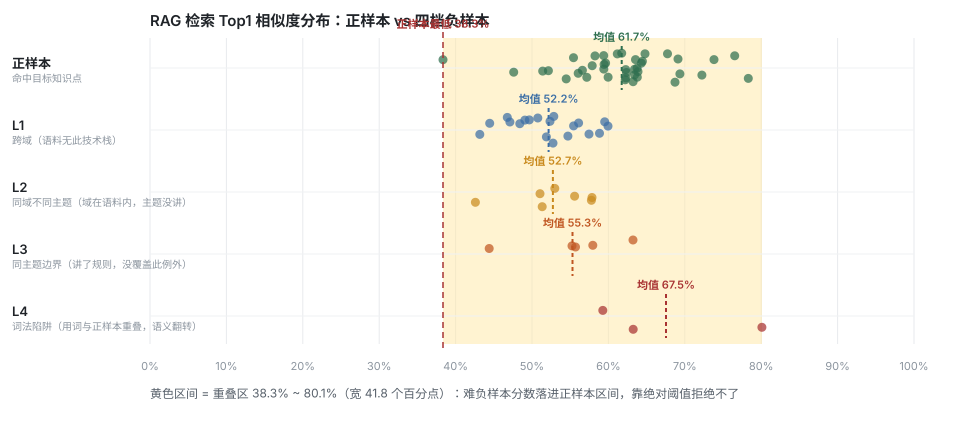

# RAG 检索质量评测报告

> 由 `scripts/eval/run-eval.py` 自动生成，语料 `scripts/eval/corpus.md`、查询 `scripts/eval/queries.json`，可完整复跑。

## 1. 评测设置

| 项 | 值 |
|---|---|
| 语料 | 30 个知识点（八股笔记，含具体参数与流程） |
| 切分 | 按 Markdown 标题优先切分，600 字上限、重叠 100 |
| Embedding | Ollama bge-m3，1024 维 |
| **检索模式** | `hybrid`（hybrid = 向量 + 关键词 tsvector + RRF 融合；vector = 纯向量） |
| 向量库 | PostgreSQL 17 + pgvector 0.8.6，HNSW + cosine |
| 正样本 | 40 条自然口语提问（措辞刻意不与文档标题重合，expect 对应知识点 tag） |
| 负样本 | 34 条，按「与语料的距离」分 L1~L4 四档（见 §3）—— 越靠后越难拒绝 |
| 命中判定 | 检索结果的 `tags` 字段包含期望 tag，不依赖人工判断 |

## 2. 正样本检索质量

| 指标 | 结果 |
|---|---|
| **Hit@1** | 34/40 = **85.0%** |
| Hit@3 | 40/40 = 100.0% |
| Hit@5 | 40/40 = 100.0% |
| **MRR** | **0.912** |
| Top1 相似度 | 均值 61.8%，区间 40.1%~78.3% |

以下 6 条查询的正确答案**未排在 Top1**（最后一列是它在结果中的实际排名，`>5` 表示未被召回）：

| 期望知识点 | 提问 | 实际 Top1 | 正确排名 |
|---|---|---|---|
| `jvm-classload` | 为什么自己写一个 java.lang.String 不会生效 | 事务失效与传播行为 | 3 |
| `jvm-oom` | 服务跑几个小时就崩，怎么保留现场并定位是哪块内存泄漏 | ThreadLocal 与内存泄漏 | 3 |
| `concurrency-lock` | 两个线程抢同一把锁，JVM 内部是怎么处理的，抢不到会直接挂起吗 | AQS 原理 | 2 |
| `mysql-index-fail` | SQL 里对时间字段用了 YEAR() 函数，索引还能用吗 | 慢查询定位与 SQL 优化 | 2 |
| `mysql-index-fail` | 手机号是字符类型的列，用数字去查会走索引吗 | 索引结构与 B+ 树 | 2 |
| `mysql-mvcc` | 同一个事务里两次查询结果必须一致，这是怎么做到的 | 分布式事务 | 3 |

## 2.5 混合检索的收益（与纯向量基线对照）

同一套语料、查询与 embedding，仅切换 `app.rag.hybrid.enabled`：

| 指标 | 纯向量 `vector` | 混合 `hybrid` | 变化 |
|---|---|---|---|
| **Hit@1** | 28/40 = 70.0% | 34/40 = **85.0%** | **+15.0pp** |
| Hit@3 | 95.0% | 100.0% | +5.0pp |
| Hit@5 | 95.0% | 100.0% | +5.0pp |
| **MRR** | 0.827 | **0.912** | +0.086 |
| 未命中 Top1 | 12 条 | 6 条 | -6 |

**机制**：关键词通道（tsvector + GIN 索引）用 token 精确匹配，把「语义相近但答案不同」的同域干扰项挤下去。例如「索引失效」与「索引结构」共享 `mysql`/`索引`，但不共享 `引失`/`失效`，RRF 融合后正确项排名上升。

**已知副作用**：关键词通道会引入新噪音 —— 实测有 1/40 条出现回退（「缓存和数据库的一致性」的 Top1 变成「分布式事务」）。缓解方向：调低关键词通道权重，或引入 cross-encoder rerank 做二次精排。

### 2.5.1 关键词通道对难负样本的作用（是否被词法重叠骗了？）

| 档位 | 纯向量均值 | 混合均值 | 变化 |
|---|---|---|---|
| L1 | 53.2% | 52.1% | -1.1 |
| L2 | 56.3% | 53.1% | -3.2 |
| L3 | 55.7% | 55.7% | +0.0 |
| L4 | 72.3% | 72.3% | -0.0 |

结论：**关键词通道没有被词法重叠骗** —— 它让四档负样本的分数**全部下降**，同时对正样本 Hit@1 是提升的。机制是 RRF 融合稀释了向量通道的「语义虚高」：干扰文档在关键词通道里排名低（token 对不上），融合后被拉下去。

但要注意：L4 的绝对分数（67.5%）仍是四档最高、且远超正样本最低分，所以**难负样本依旧没有被解决** —— 混合检索改善的是排序，不是「知道边界在哪」。

## 3. 负样本分级（L1~L4）

负样本按「与语料的距离」分四档 —— **越靠后越难拒绝**，因为它们与正样本共享越多词汇和语义：

| 档位 | 含义 | n | Top1 相似度均值 | 最高 |
|---|---|---|---|---|
| **L1** | 跨域（语料无此技术栈） | 19 | 52.1% | **59.9%** |
| **L2** | 同域不同主题（域在语料内，主题没讲） | 7 | 53.1% | **59.1%** |
| **L3** | 同主题边界（讲了规则，没覆盖此例外） | 5 | 55.7% | **63.2%** |
| **L4** | 词法陷阱（用词与正样本重叠，语义翻转） | 3 | 72.3% | **80.1%** |

各档最高分的具体条目（**最该被拒绝、却拿到最高分**的）：

| 档位 | 分数 | 提问 | 命中的语料 |
|---|---|---|---|
| L1 | 59.9% | MyBatis 的一级缓存和二级缓存有什么区别 | IOC 与循环依赖 |
| L1 | 59.5% | Elasticsearch 的查询性能怎么优化 | 慢查询定位与 SQL 优化 |
| L2 | 59.1% | Redis 的大 key 怎么治理，Pipeline 和事务有什么区别 | 分布式锁 |
| L2 | 57.8% | MySQL 主从复制的 binlog 格式有什么区别，主从延迟怎么排查 | RDB 与 AOF 持久化 |
| L3 | 63.2% | not in 有时候失效有时候又能走索引，优化器的成本判断依据是什么 | 索引失效场景 |
| L3 | 58.0% | 混合检索的关键词通道权重给多少合适，RRF 的 k 值调大会有什么影响 | RAG 切分策略与检索 |
| L4 | 80.1% | InnoDB 的索引其实用 B 树就够了，没必要上 B+ 树 | 索引结构与 B+ 树 |
| L4 | 73.4% | 缓存和数据库之间用强一致方案就能彻底解决一致性问题 | 缓存穿透、击穿、雪崩 |

正样本 Top1 最低分 **40.1%**，难负样本（L2~L4）最高分 **80.1%** —— 重叠 **40.0 个百分点**。
重叠区越大，说明系统在「该拒绝」的时候越拒绝不了：用户问一个语料里没有答案、但用词很像的问题时，系统会自信地返回一个看似相关的段落。

## 4. 阈值敏感性

假设「相似度 ≥ 阈值即认为命中」，统计正样本通过率与负样本误判率：

| 阈值 | 正样本 Top1 通过 | L1 误判 | **L2~L4 误判（难负样本）** |
|---|---|---|---|
| ≥45% | 39/40 (97.5%) | 17/19 (89.5%) | **14/15 (93.3%)** |
| ≥50% | 38/40 (95.0%) | 12/19 (63.2%) | **13/15 (86.7%)** |
| ≥52% | 37/40 (92.5%) | 9/19 (47.4%) | **12/15 (80.0%)** |
| ≥54% | 36/40 (90.0%) | 7/19 (36.8%) | **10/15 (66.7%)** |
| ≥56% | 34/40 (85.0%) | 5/19 (26.3%) | **8/15 (53.3%)** |
| ≥58% | 30/40 (75.0%) | 3/19 (15.8%) | **5/15 (33.3%)** |
| ≥60% | 24/40 (60.0%) | 0/19 (0.0%) | **4/15 (26.7%)** |
| ≥65% | 8/40 (20.0%) | 0/19 (0.0%) | **2/15 (13.3%)** |
| ≥70% | 4/40 (10.0%) | 0/19 (0.0%) | **2/15 (13.3%)** |

## 5. 笔记覆盖度判定评估

§3 / §4 证明了「该拒绝的拒绝不了」—— 但这恰恰不是要「拒答」，而是要**把判定用在分析报告上**：

| 判定 | 报告里说什么 | 用户该做什么 |
|---|---|---|
| 笔记已覆盖 | 「你的笔记里已有《X》—— 这不是知识缺口」| 重新消化自己的笔记 |
| 笔记未覆盖 | 「你的笔记里没有这块内容 —— 这是知识缺口」| 补一篇笔记 |

没有这个判定，所有错题都只能给一句笼统的「去复习一下」。
判定用 `RagRelevanceGate`，与检索共用同一套信号。

### 为什么不用单一相似度阈值

正样本最低分 40.1%、难负样本最高分 80.1%，**重叠 40.0 个百分点** —— 
单一阈值必然二选一地失败。改用**双信号**：

| 信号 | 含义 | 难负样本上的表现 |
|---|---|---|
| `vecTop1` | 向量通道 top1 余弦相似度 | 偏高（语义确实像）|
| `kwCoverage` | 查询分词后落在 **top1 文档**里的 token 占比 | 偏低（具体词对不上）|

判定规则（阈值可配）：`vecTop1 < vecLow 且 coverage < covLow` → 判「无覆盖」；`vecTop1 < vecMid 且 coverage < covMid` → 判「无覆盖」。

> **踩过的坑**：第二个信号最初用的是「关键词通道命中文档数」，实测**完全无效** —— 关键词通道是 OR 查询（`tok1 | tok2 | ...`），任意一个 token 命中就计数，而「消息」「处理」「怎么」这类通用词在语料里到处都是。跨域的「Kafka 消息积压该怎么处理」照样命中 6 个文档，正负样本命中数都是 6~15，毫无区分度。换成覆盖率（要求 token 落在**同一个文档**里）之后才有区分力。

### 实测（阈值由网格搜索得到）

| 指标 | 结果 |
|---|---|
| **正样本误判**（笔记里其实有，却判成缺口）| 4/40 = 10.0% |
| 负样本正确识别（确实没有，判成缺口）| 24/34 = 70.6% |
| L1 档正确识别率 | 16/19 = 84.2% |
| L2 档正确识别率 | 4/7 = 57.1% |
| L3 档正确识别率 | 4/5 = 80.0% |
| L4 档正确识别率 | 0/3 = 0.0% |

### 阈值权衡（同一批信号本地模拟，不重调模型）

| vecLow | vecMid | covLow | covMid | 正样本误判 | L1 识别 | L2~L4 识别 |
|---|---|---|---|---|---|---|
| 0.40 | 0.55 | 0.15 | 0.30 | 2/40 | 11/19 | **4/15** |
| 0.40 | 0.55 | 0.15 | 0.35 | 2/40 | 11/19 | **4/15** |
| 0.40 | 0.55 | 0.15 | 0.40 | 2/40 | 11/19 | **4/15** |
| 0.40 | 0.55 | 0.15 | 0.45 | 2/40 | 11/19 | **4/15** |
| 0.40 | 0.55 | 0.15 | 0.50 | 2/40 | 11/19 | **4/15** |
| 0.40 | 0.55 | 0.20 | 0.30 | 2/40 | 11/19 | **4/15** |
| 0.40 | 0.55 | 0.20 | 0.35 | 2/40 | 11/19 | **4/15** |
| 0.40 | 0.55 | 0.20 | 0.40 | 2/40 | 11/19 | **4/15** |

**权衡逻辑**：把「笔记里有」误判成「没有」，代价是用户白整理一篇笔记；漏判「确实没有」，代价是用户的补强计划里少了一个真实缺口。两者都要压，所以取「误判可控时识别率最高」的点。

> 局限：判定只有「有 / 没有」二元，表达不了「部分覆盖」。L3 这类「笔记讲了规则、没讲这个例外」的知识点会被判成「已覆盖」——但用户其实需要补充边界情况。要解决它需要笔记带上「覆盖范围」的元信息，属后续工作。

## 6. 结论

1. **排序指标可用**：Hit@1 85.0%、Hit@3 100.0%、MRR 0.912，说明检索在「自然口语提问 → 知识点」这个任务上排序是有效的。
2. **绝对相似度不可作阈值**：L1 负样本最高分 59.9%，但 L2~L4（同域 / 边界 / 词法陷阱）最高分也到了 80.1%，比正样本最低分（40.1%）还高 40.0 个百分点 —— 区间完全重叠。要让**难**负样本误判归零，阈值须提到 81% 以上，此时正样本通过率只剩 0.0%。**不存在可用的工作点**，因此这类系统的验收标准只能是排序指标（Hit@K / MRR），而不是「相似度 > 0.7 才算命中」。
3. **L1 与 L2~L4 是两个不同的问题**：L1 分数明显更低（均值 52.1%），说明「问别的技术栈」系统是能识别的；但 L2~L4 抬升到 57.8%，与正样本区间重叠 ——**真正的风险不是「问别的技术栈」，而是「问同域里没讲的那个点」**。
4. **topK = 3 是性价比最高的取值**：6 条查询的正确答案不在 Top1，其中 6 条落在 Top2~Top3；Hit@3 与 Hit@5 相同（均 100.0%），说明取 3 条已覆盖全部可召回结果，取 5 条只是徒增送入 LLM 的上下文开销。
5. **提升方向**：剩余错误来自主题相近的知识点互相干扰 —— 已落地混合检索（向量 + 关键词 tsvector + RRF），Hit@1 从 70%% 提到 85%%；进一步可用 cross-encoder rerank 做语义级精排。

---

*评测耗时 4 秒；命中判定基于文档 tags 自动完成，无人工标注介入。*
